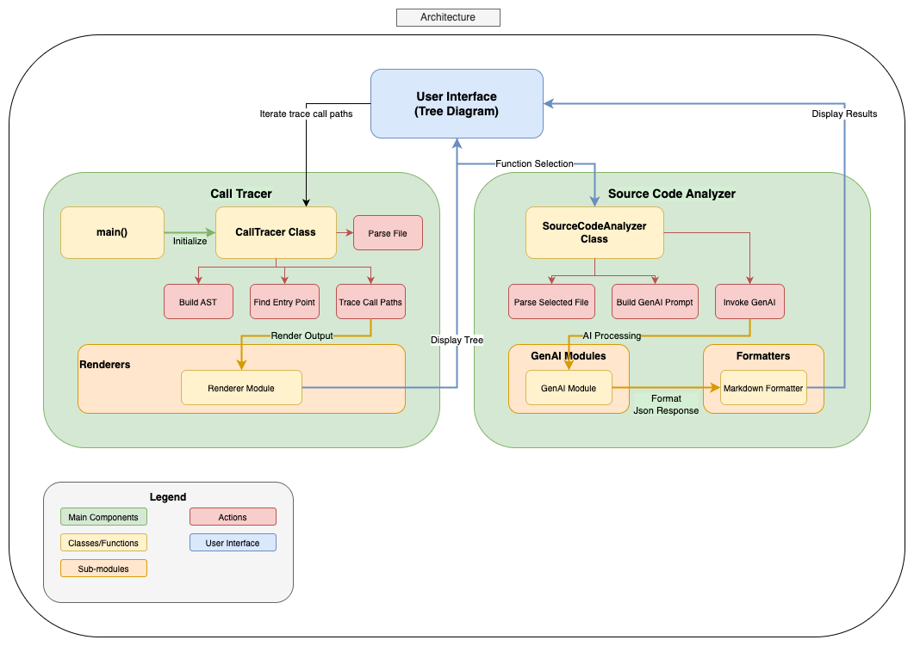
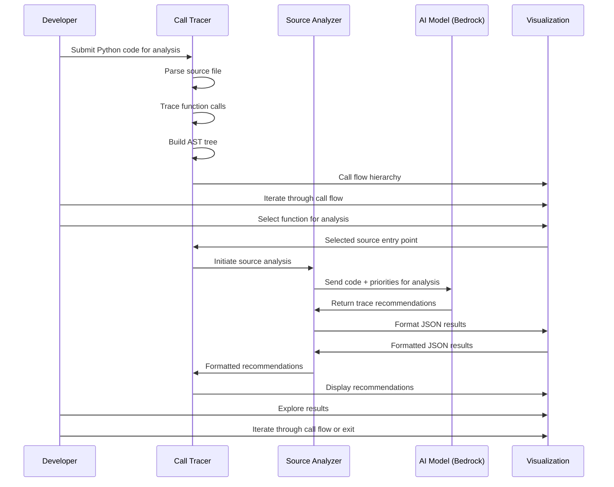

# Insights Solution Spotlights

## Solution Spotlight – Trace Injection Advisor

AI-Powered Tool for Intelligent Distributed Tracing Implementation

## Overview

In today's complex microservices architectures, effective observability through distributed tracing is crucial for maintaining system performance and reliability. However, implementing comprehensive tracing across codebases presents significant challenges: determining optimal trace placement, understanding call flows, and ensuring coverage without performance degradation. Manual instrumentation is time-intensive, error-prone, and often results in inconsistent or insufficient coverage that leaves critical system behaviors unobserved.

Traditional approaches to distributed tracing instrumentation require developers to manually identify and instrument key points in their code. This process demands deep understanding of application flow, significant time investment, and specialized expertise in observability best practices. Many teams struggle with over-instrumentation that impacts performance or under-instrumentation that misses critical insights. The result is often incomplete visibility during production incidents when observability matters most.

To address these challenges, we introduce the **Trace Injection Advisor**, an AI-powered solution that combines intelligent code analysis with dynamic call tracing to provide comprehensive guidance on optimal trace placement. Our solution features two complementary components: an AI-powered Source Analyzer that identifies critical trace points based on configurable priorities, and a dynamic Call Tracer that maps complete function call flows to understand application behavior patterns.

The Source Analyzer leverages advanced AI models (including Anthropic Claude 3 Sonnet and Meta Llama 3.2) to analyze Python source code and recommend optimal locations for trace injection based on priorities like exception handling blocks, conditional branches, external resource interactions, and performance-critical code paths. The Call Tracer dynamically follows function calls across files and modules, building comprehensive call trees that reveal how application components interact. Together, these tools provide developers with intelligent, data-driven guidance for implementing effective distributed tracing strategies.

Through our Trace Injection Advisor solution, development and SRE teams can dramatically reduce the time and expertise required to implement comprehensive observability. Instead of manual guesswork, teams receive AI-generated recommendations backed by thorough code analysis, leading to more effective tracing strategies, better incident response capabilities, and improved system reliability.

## Prescriptive Guidance

Before diving into the Trace Injection Advisor, it is important to acknowledge the following terminology.

### Definitions

- **AI Model** – Large language model used for intelligent code analysis, supporting multiple providers including AWS Bedrock
- **AST (Abstract Syntax Tree)** – Tree representation of source code structure used for code analysis
- **Call Tracer** – Component that dynamically traces function calls across files to build execution flow maps
- **Source Analyzer** – AI-powered component that identifies optimal locations for trace statement placement
- **Trace Injection** – The process of adding observability instrumentation to specific code locations
- **Entry Point** – Starting function or method from which call tracing begins
- **Formatter** – Component responsible for converting analysis results into human-readable formats
- **Search Paths** – Directories where the tracer looks for external modules and dependencies
- **Tracing Priorities** – Configurable criteria used by AI to identify critical locations for instrumentation
- **AWS Bedrock** – Amazon's managed AI service platform for accessing foundation models
- **Jinja2** – Template engine used for flexible output formatting
- **FastHTML** – Rendering framework used for interactive trace visualization

### Strategy

When faced with implementing distributed tracing across complex Python applications, development teams need systematic approaches for identifying optimal instrumentation points. Manual analysis of large codebases is time-consuming and often misses critical trace opportunities. The Trace Injection Advisor solution uses AI-powered analysis and dynamic call tracing to provide data-driven recommendations that eliminate guesswork and ensure comprehensive coverage.

The Trace Injection Advisor is composed of three main components: **Tracing** (dynamic call flow mapping), **Analysis** (AI-powered code examination), and **Formatting** (flexible output generation). This solution focuses primarily on tracing and analysis capabilities, with configurable rendering and formatting options to integrate with existing development workflows.

During Analysis, the Source Analyzer builds an AST representation of the code and uses AI models to evaluate each section against the configured priorities. The AI provides specific recommendations including function names, code blocks to instrument, rationale for each recommendation, and suggested trace information to capture. Simultaneously, the Call Tracer can map the complete execution flow from any entry point, showing how functions call each other across modules and files, revealing the application's runtime behavior patterns.

For more details on what each component does, see the details below.

### Tracing

The Call Tracer component provides dynamic analysis capabilities, mapping complete function call flows to understand application execution patterns. This component takes a different approach from static analysis, actually following the call chain from specified entry points to build comprehensive execution trees.

Key features include cross-file call resolution that follows imports and searches directories, import mapping that handles both absolute and relative imports, class attribute analysis to resolve method calls on objects, and circular reference prevention through visited function tracking. The system supports configurable search paths for finding external modules and generates unique IDs for each call node to enable tree navigation.

### Analysis

The Source Analyzer serves as the intelligent core of our solution, leveraging AI models to provide data-driven recommendations for trace placement. This component begins when source code (file or directory) is provided for analysis, i.e., from the Call Tracer. The analyzer parses the code into an AST representation, then uses configured AI models to evaluate the code structure against predefined tracing priorities.

The analysis workflow follows a structured approach, with the AI model examining code patterns and providing comprehensive recommendations. The system supports multiple AI models through AWS Bedrock, including Anthropic Claude 3 Sonnet and Meta Llama 3.2, with configurable parameters for temperature, retry logic, and token limits. Each model brings different strengths: Claude excels at detailed code analysis and contextual understanding, while Llama provides efficient processing for large codebases.

For each identified location, the AI provides detailed analysis including the specific function/method name, fully-qualified name for context, exact code blocks to instrument, clear rationale explaining why tracing is beneficial, and recommended trace information to capture (parameters, return values, timing, etc.).

### Error Handling

The system implements robust error handling with configurable retry logic, supports both single-file and directory analysis modes, and outputs results in structured JSON format for downstream processing. Advanced features include token usage tracking for cost management, validation of AI model responses, and flexible configuration through YAML files.

### Formatting

The Trace Injection Advisor includes a flexible formatting system that converts analysis results into actionable reports. The formatting component supports multiple output strategies through a pluggable architecture, allowing teams to customize output formats for their specific workflows and tools.

The system includes two primary formatting implementations: **Coded Formatter** that implements formatting logic directly in Python code for maximum control and customization, and **Jinja2 Formatter** that uses template-based formatting for easier modification without code changes. Both formatters convert JSON analysis results into well-structured Markdown reports with consistent formatting.

The formatting output includes comprehensive sections covering model information and configuration details, executive summary of analysis findings, priority-based recommendations organized by tracing categories, detailed code block analysis with specific instrumentation guidance, and token usage statistics for cost tracking and optimization.

For trace visualization, the Call Tracer integrates with multiple rendering systems including **FastHTML Renderer** for interactive web-based trace trees with expandable nodes and detailed call information, and **Streamlit Renderer** for dashboard-style visualization with filtering and search capabilities. These rendering options make it easy to explore complex call trees and understand application execution patterns.

## Best Practices / Design Principles

### Choice of AI Model

Model selection significantly impacts analysis quality, accuracy, and cost. The Trace Injection Advisor supports multiple AI models through AWS Bedrock, providing flexibility to choose models based on specific requirements and constraints.

**Anthropic Claude 3 Sonnet** excels at detailed code analysis and provides nuanced understanding of complex codebases. It offers excellent reasoning capabilities for identifying subtle trace opportunities and provides detailed rationale for recommendations. This model is ideal for comprehensive analysis of critical applications where accuracy is paramount.

**Meta Llama 3.2 3B Instruct** provides efficient processing with faster response times and lower token costs. While less detailed than Claude, it offers solid performance for large-scale code analysis and bulk processing scenarios. This model suits development teams processing extensive codebases with cost constraints.

Organizations requiring on-premises deployment or custom fine-tuning may prefer self-hosted models. The solution's modular architecture supports custom model implementations, enabling integration with organization-specific AI infrastructure while maintaining the same analysis capabilities.

### Configuration Management

The solution uses YAML-based configuration files that centralize all system settings, making it easy to customize behavior for different projects and environments. Key configuration areas include AI model selection and parameters (temperature, retry logic, token limits), tracing priorities and their relative importance, formatter selection and template paths, and AWS region configuration for Bedrock access.

### Search Path Strategy

Effective search path configuration is crucial for accurate call tracing across complex Python projects. The Call Tracer requires proper search paths to resolve imports and follow function calls across modules. Best practices include adding project root directory for local module resolution, including virtual environment site-packages for dependency analysis, and specifying custom library paths for proprietary modules.

Search path ordering affects resolution priority, with earlier paths taking precedence. This allows override behavior for testing or development scenarios. The system caches parsed modules across search paths to improve performance during analysis of large codebases.

### Output Integration

The flexible formatting system enables integration with various development tools and workflows. Teams can customize output formats to match their documentation standards, integrate with existing observability tooling, and automate report generation through CI/CD pipelines.

For interactive analysis, the FastHTML renderer provides web-based exploration of call trees, while Streamlit integration offers dashboard-style visualization with filtering capabilities. Custom formatters can generate outputs compatible with specific monitoring platforms or development tools.

## Security Concerns

Access control for the Trace Injection Advisor primarily relies on filesystem permissions and AWS credentials management. Since the solution analyzes source code locally, ensure proper file system access controls and secure handling of analysis results that may contain sensitive code information.

For AI model interactions through AWS Bedrock, the main security consideration involves data transmission to third-party model providers. According to AWS Bedrock's data protection policies, "Amazon Bedrock doesn't store or log your prompts and completions. Amazon Bedrock doesn't use your prompts and completions to train any AWS models and doesn't distribute them to third parties." Models operate in isolated environments within dedicated deployment accounts.

When using self-hosted models, data privacy concerns are eliminated since all processing occurs within the organization's infrastructure. This approach provides complete control over sensitive code analysis while maintaining the solution's analytical capabilities.

Additional security considerations include secure storage of configuration files containing API keys, audit logging of analysis activities for compliance, and encryption of analysis results when stored persistently. Teams should implement appropriate data classification policies for code analysis outputs.

## Cost and Usage

Source code analysis typically costs between $0.05-$0.15 per file depending on model choice and file complexity. Analysis time ranges from 10-30 seconds per file for most codebases. Cost and performance are primarily influenced by AI model selection, code complexity and file size, number of configured tracing priorities, and retry logic configuration.

**Cost Optimization Strategies:**
- Use Meta Llama models for large-scale batch processing
- Configure appropriate token limits to prevent runaway costs  
- Implement file filtering to exclude non-critical files
- Batch similar files together for efficient processing
- Monitor token usage through built-in tracking capabilities

Call tracing operations are computationally local and don't incur AI model costs, making them suitable for iterative analysis and large codebase exploration. The combination of both components provides comprehensive analysis with controlled costs.

## Trace Injection Advisor Architecture

The Trace Injection Advisor consists of two main analysis components working in concert: the **Call Tracer** for dynamic execution flow mapping and the **Source Analyzer** for AI-powered static analysis. Both components integrate through a shared configuration system and flexible output formatting pipeline.

### Components

- **Python Runtime Environment:**: Development platform supporting Python 3.13+ with required dependencies
- **Configuration Management**: YAML-based configuration with validation and environment-specific overrides  
- **Source Analyzer Engine**: AI-powered static code analysis with intelligent trace recommendation
- **Call Tracer Engine**: Dynamic call flow analysis with cross-module resolution and tree generation
- **AI Model Integration**: AWS Bedrock connectivity supporting multiple model providers (Claude, Llama)
- **Formatting Pipeline**: Flexible output generation with template support and multiple rendering options
- **Utility Framework**: Shared logging, file operations, and configuration management services
- **Output Renderers**: FastHTML and Streamlit integration for interactive trace visualization

### How it works

#### Call Tracing Workflow

The process begins with the Call. Dynamic call tracing operates independently, mapping execution flows from specified entry points. Developers provide a source file, entry point name, and a list of search paths, and the Call Tracer builds a complete execution tree showing how functions call each other across modules.

The tracer follows imports, resolves function calls across files, and handles various call patterns including method calls, module functions, and nested attributes. The resulting call tree reveals application execution patterns and helps identify additional trace opportunities missed by static analysis.

Interactive visualization through FastHTML or Streamlit renderers enables exploration of complex call trees, making it easy to understand application flow and plan comprehensive tracing strategies.

#### Source Analysis Workflow

The source analysis process begins when developers specify source files or directories for examination, or from Call Tracer UI. The Source Analyzer loads the specified files, parses them into AST representations, and prepares analysis prompts based on configured tracing priorities.

The AI model analyzes each source file section against the configured priorities, identifying critical locations for trace injection. The model provides comprehensive recommendations including specific function names, code block locations, rationale for each recommendation, and suggested trace information to capture.

Results are processed through the formatting pipeline, generating structured Markdown reports that development teams can use to guide their instrumentation efforts. The flexible formatter architecture supports custom output formats and integration with existing development workflows.

## Blueprint

The GitHub repository is [here](https://github.com/VerticalRelevance/distributed-tracing)

## Benefits

### Technical Excellence
- **AI-Powered Intelligence**: Leverages advanced AI models (Claude 3 Sonnet, Meta Llama 3.2) to identify optimal trace locations with detailed rationale, eliminating guesswork and ensuring comprehensive coverage
- **Dynamic Call Flow Analysis**: Maps complete execution paths across modules and files, revealing hidden application interactions and dependencies that static analysis alone cannot discover
- **Comprehensive AST Parsing**: Analyzes code structure at the syntax tree level, understanding complex patterns including nested function calls, class hierarchies, and cross-module dependencies
- **Intelligent Priority Engine**: Configurable analysis priorities (exception handling, conditional branches, external integrations) tailored to specific application domains and business requirements

### Enterprise Scalability & Integration
- **Multi-Model AI Support**: Flexible integration with multiple AI providers through AWS Bedrock, enabling cost optimization and performance tuning based on organizational requirements
- **Extensible Architecture**: Factory pattern implementation for formatters, renderers, and AI models enables rapid customization and integration with existing enterprise toolchains
- **Configuration Management**: YAML-based configuration with comprehensive validation, environment-specific overrides, and centralized policy management
- **CI/CD Pipeline Integration**: Command-line interfaces and programmatic APIs enable seamless integration with automated build processes and continuous integration workflows

### Operational Efficiency & Cost Management
- **Token Usage Tracking**: Built-in cost monitoring and optimization features provide visibility into AI model usage and enable budget management across development teams
- **Batch Processing Capabilities**: Efficiently processes entire codebases and directory structures, making it suitable for large-scale enterprise application analysis
- **Intelligent Caching**: Module-level caching and visited function tracking optimize performance and reduce redundant analysis across large codebases
- **Flexible Output Formats**: Multiple rendering options (FastHTML web UI, Streamlit dashboards, Markdown reports, JSON exports) accommodate diverse enterprise reporting and integration requirements

### Risk Mitigation & Compliance
- **Deterministic Analysis**: Provides consistent, repeatable results that support audit trails and compliance documentation for regulated industries
- **Security-First Design**: Local processing capabilities eliminate concerns about sensitive code exposure while still providing AI-powered insights
- **Comprehensive Error Handling**: Robust retry logic, validation frameworks, and graceful failure handling ensure reliable operation in production environments
- **Data Privacy Controls**: Configurable AI model selection supports both cloud-based and on-premises deployment models based on organizational security requirements

### Developer Experience & Productivity
- **Interactive Visualization**: Web-based exploration tools (FastHTML, Streamlit) enable intuitive navigation of complex call hierarchies and analysis results
- **Context-Aware Recommendations**: AI-generated suggestions include specific rationale, code locations, and recommended trace information, accelerating implementation decisions
- **Multi-Level Analysis**: Supports both file-level and directory-level analysis, accommodating different workflow patterns from focused debugging to comprehensive system review
- **Template-Based Customization**: Jinja2 template support enables rapid customization of reports and outputs to match organizational documentation standards

### Organizational Maturity Enhancement
- **Standardized Observability Practices**: Establishes consistent approaches to distributed tracing across development teams, reducing knowledge silos and improving system reliability
- **Knowledge Transfer Acceleration**: Detailed analysis reports and interactive visualizations help new team members understand complex application architectures more quickly
- **Technical Debt Reduction**: Systematic identification of instrumentation gaps enables proactive improvement of observability coverage before production issues occur
- **Cross-Team Collaboration**: Shareable analysis results and standardized reporting formats facilitate communication between development, SRE, and operations teams

## End Result

The ultimate goal of the Trace Injection Advisor is to democratize effective distributed tracing implementation while significantly advancing organizational observability maturity. This solution enables development teams to quickly identify and instrument optimal trace points without requiring specialized observability expertise, fundamentally transforming how enterprises approach system instrumentation.

### Immediate Technical Impact
By combining AI-powered static analysis with dynamic call flow mapping, teams gain comprehensive visibility into their applications' execution patterns and can implement targeted instrumentation strategies. This intelligent approach leads to more effective observability coverage, faster incident resolution through better trace data, reduced time-to-insight during debugging sessions, and improved system reliability through proactive monitoring.

### Long-term Organizational Transformation
The solution transforms distributed tracing from a complex manual process into an intelligent, data-driven practice that scales with application complexity. For large enterprise organizations, this represents a fundamental shift toward:

**Observability Center of Excellence**: Establishes standardized practices and tooling that can be scaled across multiple development teams, business units, and technology stacks, creating organization-wide consistency in approach to system instrumentation.

**Reduced Time-to-Production**: New applications and features reach production faster with comprehensive observability coverage from day one, eliminating the traditional lag between development and proper instrumentation that often leads to blind spots during critical early production phases.

**Enhanced Incident Response Maturity**: Teams respond to production issues with significantly better context and data, reducing mean time to resolution (MTTR) and improving overall system reliability. The proactive identification of trace points means fewer "unknown unknowns" during outages.

**Cross-functional Knowledge Sharing**: Interactive visualizations and standardized analysis reports facilitate better communication between development, SRE, operations, and business stakeholders, breaking down traditional silos and improving overall technical decision-making.

**Regulatory Compliance and Audit Readiness**: Deterministic, repeatable analysis processes support compliance requirements in regulated industries while providing clear audit trails for observability implementation decisions.

**Strategic Technical Debt Management**: Systematic identification of observability gaps enables organizations to prioritize infrastructure improvements and technical debt reduction based on actual risk assessment rather than guesswork.

The Trace Injection Advisor ultimately positions organizations to achieve mature, enterprise-grade observability practices that scale efficiently across complex, distributed systems while maintaining the agility needed for rapid innovation and growth.